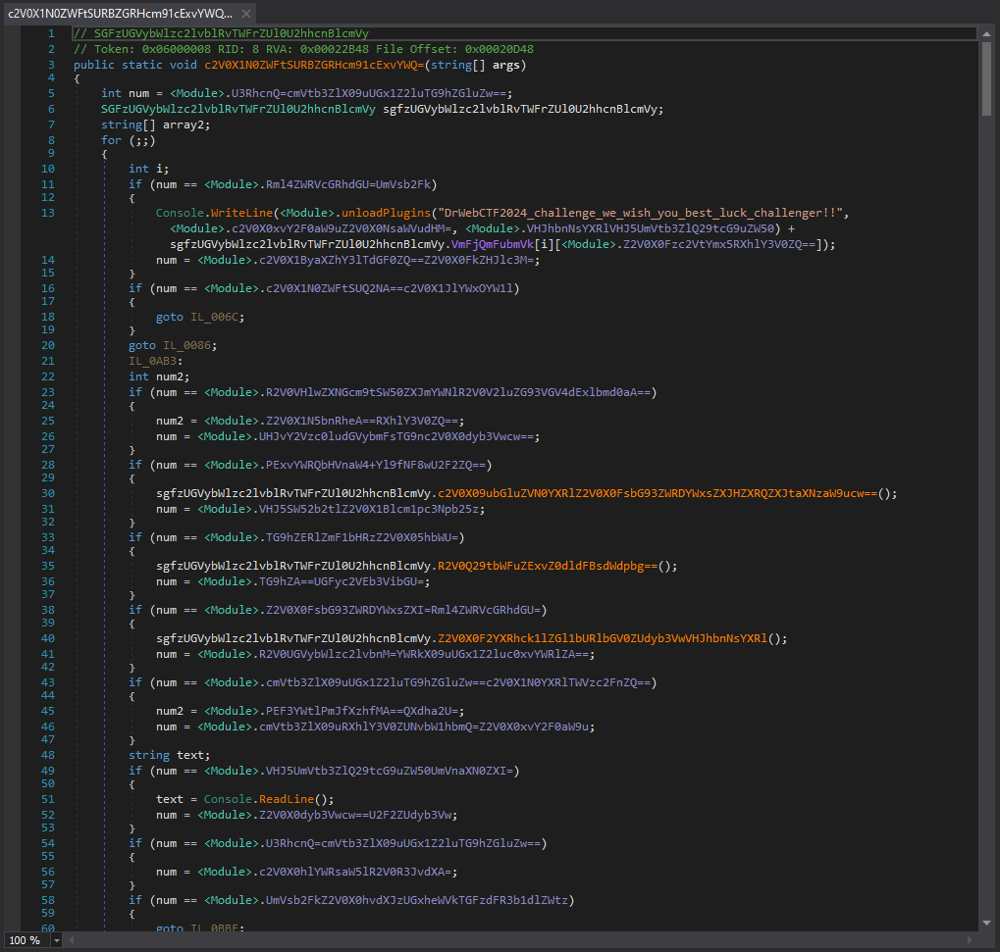
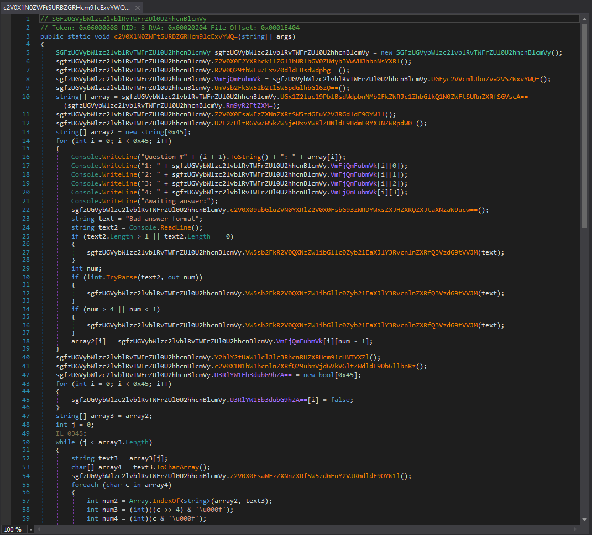

Description
===========

This is a custom version of de4dot designed to perform control flow deobfuscation and string decryptor for an unknown obfuscator (i named it "bebra") used in the DrWeb CTF challenge, "ABitConfused".

How to use de4dot
=================

    de4dot .\DearApplicants_10.exe -p un --preserve-tokens --keep-types --dont-create-params --preserve-strings --preserve-us --preserve-blob --preserve-sig-data --dont-rename

Output
======

Before:

After:

